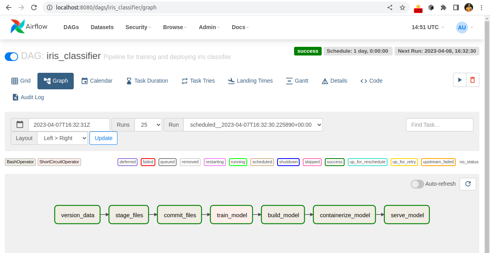

# MLOps reference implementation

Эталонный пример использования платформ MLOps для управления жизненным циклом моделей МО.

Является материалом к курсу лекций "Проектирование приложений с элементами ИИ" для 
магистров Политеха, ВШИИ.


## О проекте

Цель проекта -- демонстрация примера использования набора инструментов и платформ MLOps для
автоматизации процесса (пере)обучения и вывода в продуктив модели МО.

Рассматривается следующий сценарий:
 * данные, доступные для обучения модели, обновляются; в данном примере используется датасет [Iris](https://archive.ics.uci.edu/ml/datasets/iris)
 * для отслеживания изменений в данных применяется платформа [DVC](https://dvc.org/)
 * раз в день запускается процесс обучения новой версии модели
 * процесс обучения модели и полученные в результате этого артефакты отслеживаются с помощью [MLFlow](https://mlflow.org/)
 * новая модель оборачивается в HTTP REST сервис и поставляется в виде Docker контейнера с помощью [BentoML](https://docs.bentoml.org/en/latest/index.html)
 * весь процесс управляется (оркестрируется) при помощи [Airflow](https://airflow.apache.org/)

Данный пример во многом переиспользует описанное в этой статье: 
https://mymlops.com/examples/airflow-mlflow


## Как запустить

Ниже описывается работа под Linux. В частности, использются команды bash.
Под Windows все работает аналогично, более того, можно воспользоваться одним из эмуляторов командной строки Linux
под Windows.

### Версия Python

Протестировано с Python 3.8.15. 

Должно работать и с другими версиями при условии наличия библиотек для Airflow, MLflow, BentoML 
(другие библиотеки не должны вызывать затруднений).

### Требования

Требования перечислены в [requirements.txt](./requirements.txt)

### Установка

Для начала склонировать проект:
```shell
git clone git@github.com:polytech-lectures-ml-apps-design/mlops-reference-implementation.git
cd mlops-reference-implementation
```

Рекомендуется создать отдельное виртуальное окружение под Python 3.8 
(для управление несколькими версиями Python удобно использовать [pyenv](https://github.com/pyenv/pyenv):
```shell
python -m venv .venv
```

И установить в него все зависимости:
```shell
source .venv/bin/activate
pip install -r requirements.txt
```

Также требуется наличие установленного Docker и Docker Compose: 
[инструкция по установке и настройке](https://www.digitalocean.com/community/tutorials/how-to-install-and-use-docker-compose-on-ubuntu-22-04)

### Запуск

1. Запустить tracking сервер MLflow: `mlflow server`
1. Запустить Airflow: `airflow standalone`
1. Тренировка моделей (в режиме предварительного анализа, 
автоматизированная тренировка происходит в операторе Airflow и не требует этого ноутбука): 
[notebooks/iris_classifier.ipynb](notebooks/iris_classifier.ipynb)
1. В интерфейсе Airflow (по умолчанию http://localhost:8080/) вручную запустить DAG **iris_classifier**:

1. После успешного выполнения всей цепочки операций можно проверить результаты:
   1. в интерфейсе MLflow (http://localhost:5000/#/experiments/ по умолчанию) появится новый запуск (run)
   
   1. сделать запрос к сервису через http://localhost:5001/#/Service%20APIs/iris-classifier__predict
   1. при помощи ноутбука [notebooks/test_predictions.ipynb](notebooks/test_predictions.ipynb) 
   сделать запрос к развернутой модели в коде
   2. убедиться, что появился новый докер контейнер и что он запущен:
   ```shell
   docker images
   docker ps
   ```


### Данные

Данный проект использует [Iris датасет](https://archive.ics.uci.edu/ml/datasets/iris).
Загрузка происходит в коде при первом запуске при помощи scikit-learn. 
После первого запуска данные сохраняются локальное (через DVC).


## Useful links

Формат записи данных в платформу:
https://confluence.dct-ai.com/pages/viewpage.action?pageId=7671770

  + connected SW (other repos)
  + literature
  + confluence
  + detailed code documentation (type: reference)
  + further how-to-guides


## Contributing

Contributions are highly welcome! For more details check [contribution guide](./CONTRIBUTING.md).
